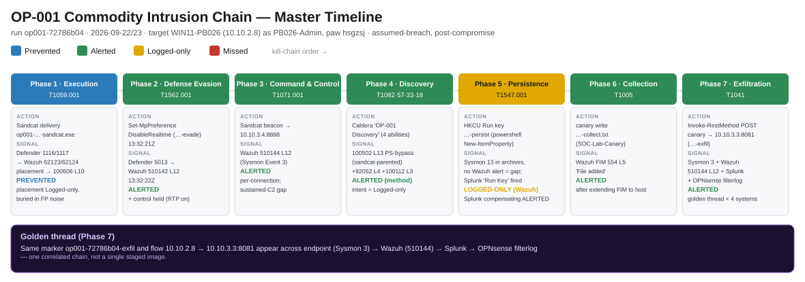
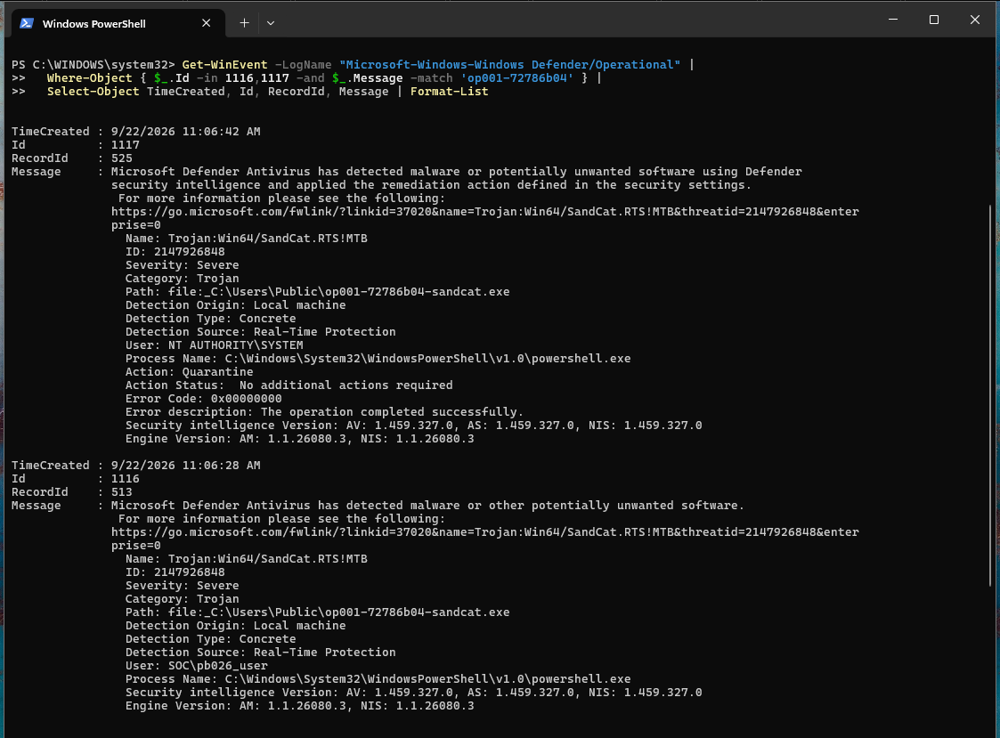
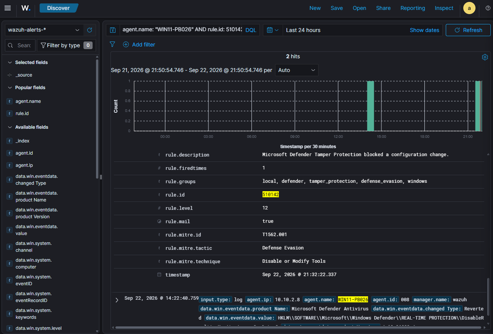
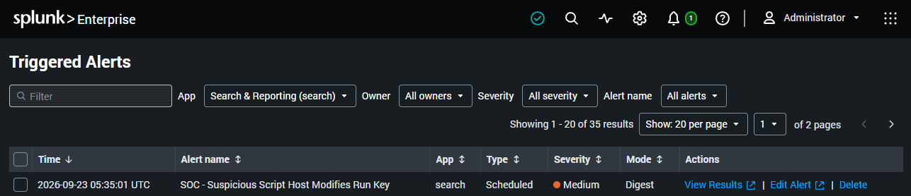
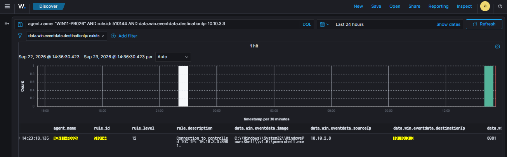

# CASE-OP001 · Commodity Intrusion on a Workstation

| **Case** | CASE-OP001 (purple-team operation OP-001) |
|---|---|
| **Dates** | 2026-09-22 to 2026-09-23 |
| **Status** | Closed: recovered and negative-validated |
| **Host** | `WIN11-PB026` (10.10.2.8), disposable Windows 11 Pro, domain-joined |
| **Account** | `PB026-Admin` (local administrator) |
| **Classification** | Authorized emulation. Lab IPs and accounts are fictional. |

## 1. Bottom line up front

An intruder with administrator rights on one workstation ran a full attack chain:
code execution, an attempt to weaken antivirus, a command-and-control (C2)
channel, discovery, persistence, collection of a decoy file, and exfiltration of
that file. **Defender stopped the malware from being delivered at all**, so the
intruder had to be placed on the host deliberately (assumed breach). After that,
the SOC alerted on **5 of 7 stages**, but the investigation found four gaps, the
most serious being that **the malware's launch was buried in a noisy rule with 155
false positives a week**. No data left the lab and no other host was affected.
**Top recommendation:** tune out the noisy rule and add precise detections for
persistence and long-running C2, which became the OP-004 work.

<figure class="cdl-wide" markdown>

<figcaption>Master timeline. The same marker and flow appear on the endpoint, in Wazuh,
in Splunk and in the firewall log for the exfiltration phase. Click to zoom.</figcaption>
</figure>

## 2. Disposition

- **Verdict:** True positive (authorized emulation)
- **Severity:** High. Administrator-level foothold with working C2 and exfiltration.
- **Confidence:** High. Every stage is confirmed by endpoint, SIEM and firewall evidence.
- **ATT&CK:** Execution T1059.001 · Defense Evasion T1562.001 · C2 T1071.001 ·
  Discovery T1082, T1057, T1033, T1018 · Persistence T1547.001 · Collection T1005 ·
  Exfiltration T1041

## 3. What happened

- **Who:** local administrator `PB026-Admin`, controlled by a MITRE Caldera agent
- **What:** a seven-stage intrusion, from execution through exfiltration
- **Where:** one workstation, `WIN11-PB026`; C2 server and exfil receiver in the ATTACK zone
- **When:** 2026-09-22 to 09-23
- **How:** a Caldera "Sandcat" agent driven over HTTP C2, running PowerShell with the
  execution policy bypassed
- **Why (assessed):** the behaviour of a commodity intruder: survey the host, persist,
  take data out

## 4. Timeline

Stages are listed in the order they were run. Outcome key:
🟦 Prevented · 🟩 Alerted · 🟨 Logged-only · 🟥 Missed

| Stage | Action | What the SOC saw | Outcome |
|---|---|---|---|
| 1a Delivery | Agent dropped via PowerShell, twice (once with a folder exclusion) | Defender 1116/1117 → Wazuh `62123`/`62124`: blocked by cloud reputation both times | 🟦 |
| 1b Placement | Agent started during a documented 2-minute protection exception | Only rule `100606` (L10), which fires ~155 times a week on OneDrive and updaters | 🟨 buried |
| 2 Defense evasion | `Set-MpPreference` tried to turn off real-time protection | Tamper Protection blocked it; Event 5013 → Wazuh `510142` (L12) | 🟩 + 🟦 |
| 3 C2 | Agent beaconed to `10.10.3.4:8888` | Wazuh `510144` (L12) on the first connection only | 🟩 |
| 4 Discovery | Four bounded discovery commands via the agent | `100502` (L13) PowerShell ExecutionPolicy Bypass: caught *how* it ran, not *what* it did | 🟩 |
| 5 Persistence | PowerShell wrote an HKCU `Run` value | **Wazuh silent.** The Splunk search `SOC - Suspicious Script Host Modifies Run Key` fired | 🟨 Wazuh / 🟩 Splunk |
| 6 Collection | Decoy file written under `C:\ProgramData\SOC-Lab-Canary` | Nothing at first: file monitoring wasn't deployed on this host. After adding it, Wazuh `554` (L5) | 🟩 after fix |
| 7 Exfiltration | PowerShell uploaded the decoy to `10.10.3.3:8081` | Wazuh `510144` (L12), Sysmon Event 3, OPNsense pass record | 🟩 |

### Evidence

<figure markdown>

<figcaption>Stage 1a: Defender detected and quarantined the agent (Events 1116/1117).</figcaption>
</figure>

<figure markdown>

<figcaption>Stage 2: rule <code>510142</code> (L12, T1562.001) when Tamper Protection blocked the change.</figcaption>
</figure>

<figure markdown>

<figcaption>Stage 5: Wazuh was silent; the Splunk Run-key search fired instead.</figcaption>
</figure>

<figure markdown>

<figcaption>Stage 7: rule <code>510144</code> (L12) on PowerShell connecting to the exfil receiver.</figcaption>
</figure>

## 5. Scope

- **Affected:** one workstation and one local administrator account.
- **Not affected:** the domain controller, other workstations and domain accounts.
  No lateral movement was attempted, and the only file collected was a decoy.
- **Data out:** one decoy file to a lab receiver.

## 6. Indicators

| Type | Value | Note |
|---|---|---|
| IP:port | `10.10.3.4:8888` | C2 server (Caldera) |
| IP:port | `10.10.3.3:8081` | Exfiltration receiver |
| File | `op001-…-sandcat.exe` in a user-writable staging folder | Agent binary |
| Registry | `HKCU\Software\Microsoft\Windows\CurrentVersion\Run\op001-…-persist` | Persistence |
| Path | `C:\ProgramData\SOC-Lab-Canary\…collect.txt` | Decoy accessed |

## 7. Response

- **Containment:** withheld on purpose (disposable host, controlled activity). In
  production it would go through the lab's approval-gated SOAR path: TheHive case →
  signed Slack approval → scoped action.
- **Recovery:** agent, Run value, staging exclusion, decoy file and temporary
  firewall rules all removed; Caldera showed 0 agents and stayed at 0 (no
  re-registration). Real-time protection and Tamper Protection confirmed on.
- **Negative validation:** connections from the host to both lab addresses fail again.

## 8. Detection gaps and what happened to them

| Gap | Fix | Status |
|---|---|---|
| Malware launch hidden in a rule with ~155 false positives a week | Tune `100606`; add a precise "unsigned exe from AppData launched by a script host" rule | Backlog |
| PowerShell Run-key write not alerted by Wazuh | New Wazuh rule `510150` (any script host writing a Run key) | ✅ Fixed 2026-09-25, [see detections](../detections/index.md) |
| C2 alert fires on the first connection only | Beaconing detection based on timing, not just IOC matches | Backlog → [Beacon Hunter](../tools/beacon-hunter.md) |
| File monitoring for the decoy only on one host | File monitoring built into every endpoint's baseline image; raise its severity | ✅ In the OP-002 endpoint baseline |

## 9. Analyst notes

- **An alert isn't the same as a detection.** Stage 1b technically raised an alert,
  but checking the rule's history showed it was mostly false positives, so it was
  scored as a gap, not a success.
- **This was a guided run**: attack and defence were run together. A blind re-run
  of OP-001, where the analyst investigates cold, is still to do.
- **Assumed breach:** the agent never beat Defender. Delivery was blocked, and the
  agent was placed through a short, documented exception that was reversed straight after.
