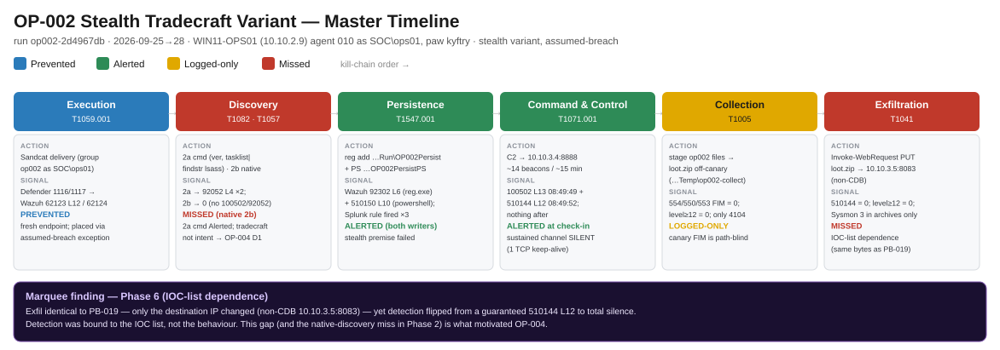
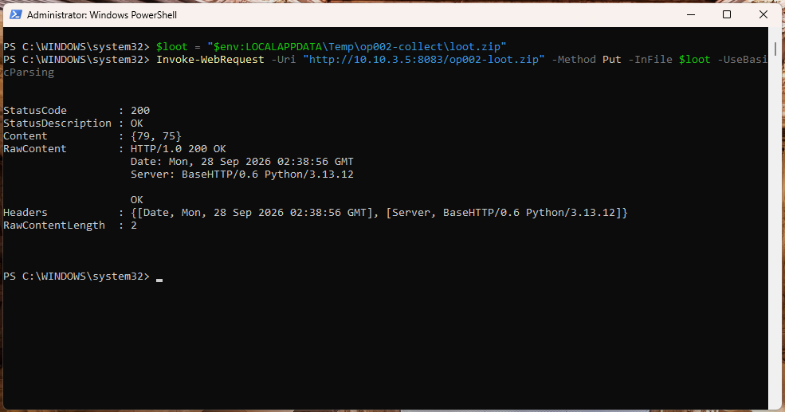
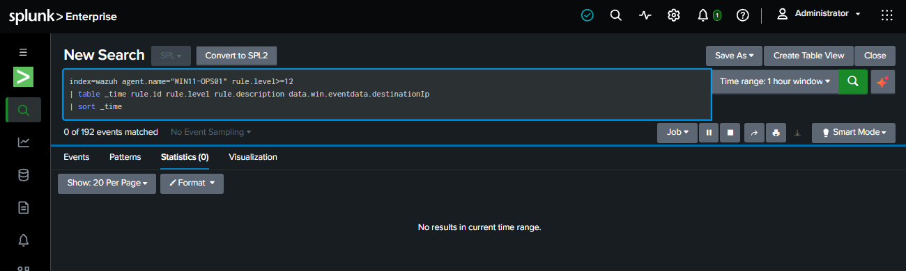
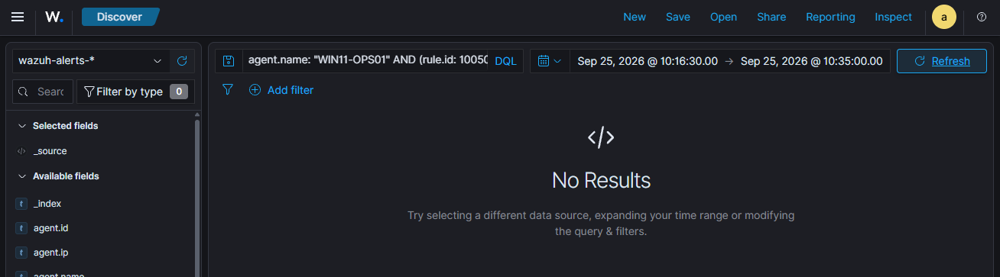

# CASE-OP002 · Quiet Intrusion Using Built-In Tools

| **Case** | CASE-OP002 (purple-team operation OP-002) |
|---|---|
| **Dates** | 2026-09-25 to 2026-09-28 |
| **Status** | Closed: recovered and negative-validated |
| **Host** | `WIN11-OPS01` (10.10.2.9), Windows 11, domain-joined |
| **Account** | `OpsAdmin` (local administrator, enabled only for the operation) |
| **Classification** | Authorized emulation. Lab IPs and accounts are fictional. |

## 1. Bottom line up front

OP-001 was caught mostly because the attacker was **noisy** and talked to
**known-bad addresses**. This case repeated the same attack quietly, using
built-in Windows tools and an address not on any blocklist. **Most of the
detections went silent.** Discovery run with native commands raised nothing, the
long-running C2 channel raised nothing after its first connection, and **a file
was successfully exfiltrated with no alert** because its destination was one IP
away from a listed address. The lesson: the SOC caught *tools and known
indicators*, not *attacker behaviour*. **Top recommendation:** detections based on
behaviour, which became OP-004 (D1, D3) and the Beacon Hunter tool.

<figure class="cdl-wide" markdown>

<figcaption>Master timeline. Three phases missed, one logged-only: the gaps that drove OP-004. Click to zoom.</figcaption>
</figure>

## 2. Disposition

- **Verdict:** True positive (authorized emulation)
- **Severity:** High. Data left the network with no alert.
- **Confidence:** High. The receiver got the 418-byte file intact, with the test
  marker verified.
- **ATT&CK:** Execution T1059 · Discovery T1082, T1057, T1033 · Persistence T1547.001 ·
  C2 T1071.001 · Collection T1005 · Exfiltration T1041

## 3. What happened

- **Who:** `OpsAdmin`, plus a Caldera agent for the C2 stages
- **What:** the OP-001 chain, with every step swapped for a quieter version
- **Where:** `WIN11-OPS01`; C2 at `10.10.3.4`, exfiltration to `10.10.3.5`
- **When:** 2026-09-25 to 09-28
- **How:** native binaries, `reg.exe` for persistence, files staged outside the
  monitored decoy folder, upload to an address not on the IOC list
- **Why (assessed):** a disciplined intruder trying not to be seen

## 4. Timeline

| Stage | Quiet technique | What the SOC saw | Outcome |
|---|---|---|---|
| 1a Delivery | Stock agent on a fresh host | Defender blocked it again (`62123`/`62124`). A new machine is not a bypass | 🟦 |
| 1b Placement | Assumed breach | `900030` (L8) "executable dropped in malware folder", **one of ~1,457 alerts in 2 hours** | 🟩 buried |
| 2a Discovery via C2 | Agent ran `cmd` instead of PowerShell | `92052` (L4) "cmd from abnormal process": quieter, still caught | 🟩 |
| 2b Discovery, native | `whoami`, `net`, `systeminfo`… in a normal shell | **Nothing** | 🟥 |
| 3a Persistence | Run key set with `reg.exe` | Wazuh `92302` and the Splunk Run-key search (3 of 3 writes) | 🟩 |
| 3b Persistence | Run key set with PowerShell | Wazuh `510150` (the OP-001 fix) and Splunk | 🟩 |
| 4a C2 established | Agent checked in to `10.10.3.4:8888` | `100502` (L13) + `510144` (L12) within 3 seconds | 🟩 |
| 4b C2 sustained | ~14 beacons over ~14 minutes on one kept-alive connection | **Nothing after check-in** (1 connection = 1 alert) | 🟥 |
| 5 Collection | Files staged and zipped in a temp folder | Only PowerShell script-block logs (4104) in the archive index | 🟨 |
| 6 Exfiltration | PowerShell upload of `loot.zip` to `10.10.3.5:8083` (not on the IOC list) | **Nothing.** Only a Sysmon Event 3 in the archive | 🟥 |

**Tally:** 🟦 1 · 🟩 5 (1 buried) · 🟨 1 · 🟥 3

## 5. Scope

- **Affected:** one workstation and one local administrator account; synthetic
  files only.
- **Not affected:** the domain controller and other hosts.
- **Data out:** a 418-byte zip of synthetic files to a lab receiver.

## 6. Indicators

| Type | Value | Note |
|---|---|---|
| IP:port | `10.10.3.4:8888` | C2 server (on the IOC list) |
| IP:port | `10.10.3.5:8083` | Exfiltration receiver (**not** on the IOC list) |
| Registry | `HKCU\…\CurrentVersion\Run\OP002Persist`, `…\OP002PersistPS` | Persistence |
| Path | `%TEMP%\op002-collect\`, `loot.zip` | Staging and archive |

## 7. Evidence and queries

**The key comparison:** the same PowerShell upload, the same bytes, two destinations.

| | PB-019 | OP-002 stage 6 |
|---|---|---|
| Destination | `10.10.3.3` (on the IOC list) | `10.10.3.5` (not on it) |
| Result | `510144` L12 alert | No alert |

<figure markdown>

<figcaption>The exfiltration: <code>loot.zip</code> uploaded to an address not on the IOC list. HTTP 200.</figcaption>
</figure>

<figure markdown>

<figcaption>The proof it was missed: no alert of level 12 or above for the host in that hour.</figcaption>
</figure>

<figure markdown>

<figcaption>Stage 2b: native discovery in a normal shell produced no alert at all.</figcaption>
</figure>

**How to hunt this:** look at everything high-severity first (`rule.level >= 12`)
instead of searching for the one rule you expect. Searching only for `510144` hid
the L13 alert at C2 check-in and nearly mis-scored that stage.

## 8. Response

- **Containment:** withheld (controlled host); would go through the
  approval-gated SOAR path.
- **Recovery:** agent stopped; staging folders, synthetic files and both Run values
  removed; Defender exclusion cleared, with real-time protection and Tamper
  Protection confirmed on. Temporary firewall rule and receiver IP removed;
  Caldera at 0 agents and 0 operations.
- **Negative validation:** the host can no longer reach the exfiltration address.

## 9. Detection gaps and what happened to them

| Gap | Fix | Status |
|---|---|---|
| Native discovery is invisible | **D1:** alert on 4+ different discovery tools on one host within 10 minutes | ✅ OP-004, [Detections](../detections/index.md) |
| Run-key search title says "script host" but it catches any writer | **D3:** renamed to "Run/RunOnce Key Modified" | ✅ OP-004 |
| Ongoing C2 and exfiltration to unknown addresses | Beaconing and unusual-egress detection that doesn't need an IOC list | Backlog → [Beacon Hunter](../tools/beacon-hunter.md) |
| Collection outside the decoy folder | Watch for staging folders, bulk copies and zips in temp | Backlog |
| Alert fatigue (~1,457 alerts in 2 hours) | Tune the low-value rules flooding the queue | Backlog |

## 10. Analyst notes: three near-misses in my own queries

Three times, a stage was almost scored wrong because of a query mistake, not a
detection gap:

1. **Wrong host field.** In Splunk, `host=` is the Wazuh server that forwards the
   logs, not the endpoint. Filtering on it returned zero and made the Run-key alert
   look missed. Filtering on `agent.name` showed it had fired.
2. **Archive fields not extracted.** Field searches on the Splunk archive index
   returned zero because the JSON fields weren't being extracted. The fix became a
   reusable extraction snippet (used in the D1/D2 searches).
3. **Searching for a single rule** hid the L13 alert at C2 check-in.

The method I use now: start with everything high-severity, filter by agent name,
and never score a stage from a zero result I haven't checked.

Also: my hypothesis that `reg.exe` would evade the Run-key search **was wrong**. It
was caught. That's reported here as a failed hypothesis, not hidden.
