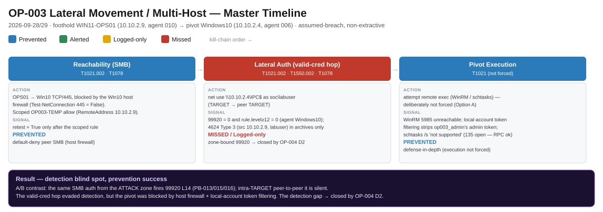
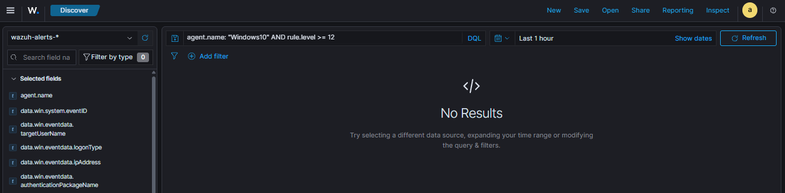
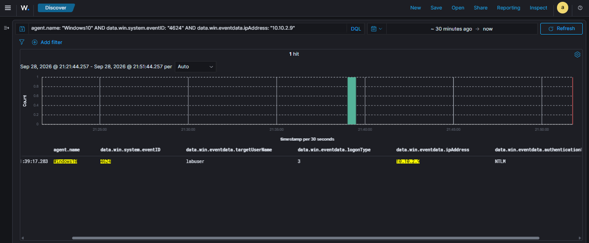

# CASE-OP003 · Lateral Movement Between Workstations

| **Case** | CASE-OP003 (purple-team operation OP-003) |
|---|---|
| **Dates** | 2026-09-28 to 2026-09-29 |
| **Status** | Closed: recovered and negative-validated |
| **Hosts** | Foothold `WIN11-OPS01` (10.10.2.9) → target `Win10` (10.10.2.4) |
| **Account** | `soc\labuser` (test domain account whose password the lab controls) |
| **Classification** | Authorized emulation. No credentials were dumped. |

## 1. Bottom line up front

From a compromised workstation, an intruder used **valid domain credentials** to
log on to a second workstation in the same network zone. **The logon raised no
alert**: the lab's lateral-movement rule only watched for logons coming from the
attacker network, and this one came from a trusted peer. However, **the intruder
could not run anything on the second machine**: its host firewall, disabled WinRM
and Windows' remote token filtering blocked execution. So this was a **detection
gap but a prevention success**. **Top recommendation:** alert on
workstation-to-workstation logons, which became OP-004 D2.

<figure class="cdl-wide" markdown>

<figcaption>Master timeline: a detection blind spot between two prevention wins. Click to zoom.</figcaption>
</figure>

## 2. Disposition

- **Verdict:** True positive (authorized emulation)
- **Severity:** Medium. The logon succeeded, but no code ran on the target.
- **Confidence:** High. The Windows 4624 event is in the archive index, the
  lateral-movement rule `99920` stayed at 0, and execution was confirmed blocked.
- **ATT&CK:** Lateral Movement T1021.002 · Valid Accounts T1078 · Use Alternate
  Authentication Material T1550.002 (tested in PB-015)

## 3. What happened

- **Who:** `soc\labuser`, a valid domain account
- **What:** network logon (type 3) from one workstation to another over SMB
- **Where:** `WIN11-OPS01` → `Win10`, both in the TARGET zone
- **When:** 2026-09-28 13:39:17 UTC (the logon)
- **How:** `net use \\10.10.2.4\IPC$` with valid credentials
- **Why (assessed):** spreading from a foothold to a second host

## 4. Timeline

| Time (UTC) | Step | What the SOC saw | Outcome |
|---|---|---|---|
| 2026-09-28 | SMB from `WIN11-OPS01` to `Win10` port 445 | Connection refused: `Win10`'s host firewall blocks peer SMB by default | 🟦 |
| 2026-09-28 | A temporary, logged firewall rule opened (test only) | n/a | n/a |
| 2026-09-28 13:39:17 | `net use \\10.10.2.4\IPC$` as `labuser` | Event 4624, type 3, source `10.10.2.9`, **in the archive only**. `99920` = 0; alerts L12+ = 0 | 🟥 |
| 2026-09-28/29 | Remote execution attempted as a local admin (`op003_admin`) | WinRM off; local-account token filtering removes admin rights over the network | 🟦 |

## 5. Scope

- **Affected:** a single logon session on `Win10`; nothing executed.
- **Not affected:** the domain controller (explicitly out of scope), other hosts. No
  credential dumping or LSASS access.

## 6. Evidence and queries

**The comparison that proves the gap:**

| Same SMB logon, from… | Wazuh `99920` |
|---|---|
| The ATTACK zone (PB-013, PB-015, PB-016) | 🟩 Level 14 alert |
| A TARGET-zone peer (this case) | 🟥 Nothing |

Only the source network changed, and the alert went from level 14 to nothing.

<div class="grid" markdown>

<figure markdown>

<figcaption>No alert: rule <code>99920</code> and every level-12+ rule stayed at zero.</figcaption>
</figure>

<figure markdown>

<figcaption>But it was logged: Event 4624, type 3, from the peer workstation, in the archive index.</figcaption>
</figure>

</div>

**The detection built afterwards (D2, Splunk):**

```spl
index=wazuh_archives "EventChannel"
| rex field=_raw "EventChannel (?<_json>\{.*\})$"
| spath input=_json
| rex field=_raw "\((?<agent_name>[^)]+)\)\s+any->EventChannel"
| rename "win.system.eventID" as eventID, "win.eventdata.logonType" as logonType,
         "win.eventdata.ipAddress" as srcip, "win.eventdata.targetUserName" as targetUser
| search eventID=4624 (logonType=3 OR logonType=10)
| where (agent_name="Windows10" OR agent_name="WIN11-OPS01")
| eval own_ip=case(agent_name=="Windows10","10.10.2.4", agent_name=="WIN11-OPS01","10.10.2.9", true(),"none")
| where match(srcip,"^10\.10\.2\.(4|9)$") AND srcip!=own_ip
```

Run over the existing data, it returns exactly one row: this hop. Across 7 days,
every other network logon was either to the domain controller or a loopback logon.

## 7. Response

- **Containment:** not needed (no execution). In production: reset the account's
  password and check where else it has logged on.
- **Recovery:** temporary firewall rule and the `op003_admin` account removed; SMB
  session dropped. No token-filtering setting was ever changed.
- **Negative validation:** `Test-NetConnection 10.10.2.4 -Port 445` returns
  False again.

## 8. Detection gaps and what happened to them

| Gap | Fix | Status |
|---|---|---|
| Lateral movement alert only watches the attacker network | **D2:** alert on any network or RDP logon between two workstations | ✅ OP-004, [Detections](../detections/index.md) |
| No "first time this account logged on to this host" check | Baseline account-to-host pairs and alert on new ones | Backlog (D2 v2) |
| Hard-coded workstation list in D2 | Replace with a maintained workstation lookup | Backlog |

## 9. Analyst notes

- **Logging on is not the same as running code.** The hop succeeded at the
  authentication layer and failed at execution, and both facts are in the report.
- **Checking a guess:** I first thought RPC (port 135) was blocked. Testing showed
  it was open, so that explanation was dropped before it reached the report.
- **Safety:** test accounts stood in for stolen credentials; no credential dumping
  and no contact with the domain controller.
