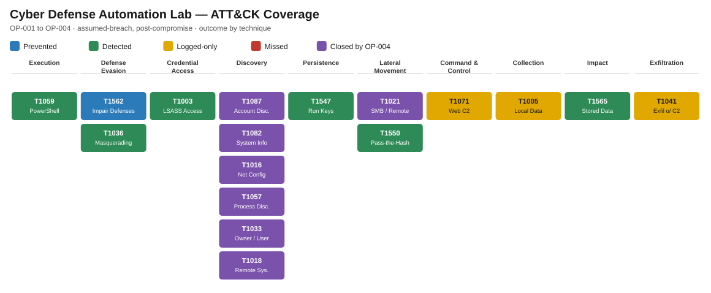

SOC analyst · detection engineering · security automation

# I build a SOC, attack it, and fix what it misses.

A segmented home SOC (Wazuh, Splunk, Sysmon, n8n, TheHive, MISP) that I run
against MITRE Caldera and Kali. Every attack is scored honestly, every miss
becomes a detection, and every detection is tested and re-run blind.

[See the results](operations/results.md){ .md-button .md-button--primary }
[Read a case](casebook/op-002-stealth-tradecraft.md){ .md-button }
[Browse the code](https://github.com/dotslashtag/cyber-defense-lab){ .md-button }

4

scored purple-team operations across 9 ATT&CK tactics

17

ATT&CK techniques exercised end to end

4 / 5

techniques found cold in the blind re-run, decoy ignored

84

automated tests on the detections and tools, run in CI

0

automatic containment actions: every response waits for a human

## The loop, in one picture

**Native discovery** · OP-002

Missed → Alerted

Built D1: 4+ discovery tools on one host in 10 min. Caught cold in ~5 min.

**Workstation → workstation logon** · OP-003

Missed → Alerted

Built D2: logons between peer workstations. Caught cold in ~6 min.

**Run-key persistence** · OP-001

Logged-only → Alerted

Found why Wazuh was silent; wrote rule `510150`. Caught in seconds.

<figure class="cdl-wide" markdown>

<figcaption>ATT&CK coverage after OP-001 to OP-004. Purple = a miss that OP-004 turned
into a working detection; amber = still logged-only, on the backlog.</figcaption>
</figure>

## Explore

-   :material-sword-cross: **Operations & results**

    ---

    Four assumed-breach operations scored Prevented / Alerted / Logged-only /
    Missed, then a blind re-run to prove the fixes.

    [:octicons-arrow-right-24: Results](operations/results.md)

-   :material-file-document-outline: **Casebook**

    ---

    Incident reports written as a SOC analyst hands off a case: bottom line,
    timeline, scope, indicators, response, and what changed.

    [:octicons-arrow-right-24: Read the cases](casebook/index.md)

-   :material-radar: **Detections as code**

    ---

    Sigma, Wazuh and Splunk rules with must-fire and must-stay-quiet tests
    that run on every change.

    [:octicons-arrow-right-24: Detections](detections/index.md)

-   :material-tools: **SOC tools**

    ---

    EVTX Hunter: triage Windows logs with the same rules, rebuild process trees,
    and send findings to TheHive. More tools on the way.

    [:octicons-arrow-right-24: Tools](tools/index.md)

## How the lab is built

Four zones under default-deny (management, monitored endpoints, attacker, WAN),
with alerts flowing Wazuh → Splunk and high-severity alerts into n8n for
enrichment, a TheHive case and a signed Slack approval before any response.

[Architecture and data flow](lab/architecture.md){ .md-button }

**Stack:** Wazuh 4.14 · Splunk 10.4 · Sysmon · OPNsense + Suricata · n8n · TheHive 5 ·
MISP 2.5 · MITRE Caldera 5.3 · Kali · Active Directory · Windows 10/11 · Ubuntu
