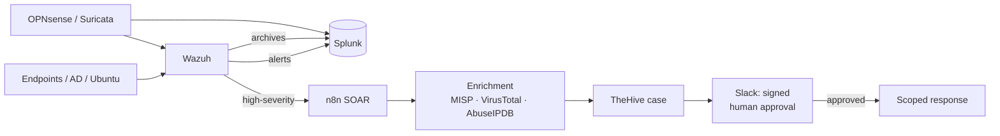

# Architecture

## Security zones

| Zone | Purpose |
|---|---|
| **WAN** | Internet uplink for OPNsense |
| **MGMT** | SOC infrastructure: Wazuh, Splunk, n8n, TheHive, MISP |
| **TARGET** | Monitored endpoints: domain controller, Windows and Linux hosts |
| **ATTACK** | Kali and Caldera adversary systems |

Traffic between zones is **default-deny**. Paths opened for an exercise are
logged and time-limited, then removed and checked closed afterwards.

## Data flow

- **Two Splunk indexes from Wazuh:** `wazuh` (alerts) and `wazuh_archives` (every
  event). Archives are what make hunting for "logged but not alerted" activity possible.
- **Network telemetry takes two paths:** Suricata → Wazuh, and OPNsense firewall
  logs → Splunk.
- **Response is gated:** n8n can enrich, open cases and recommend, but containment
  (for example disabling an account or blocking an IP) only runs after an authorized
  analyst approves it in Slack.
