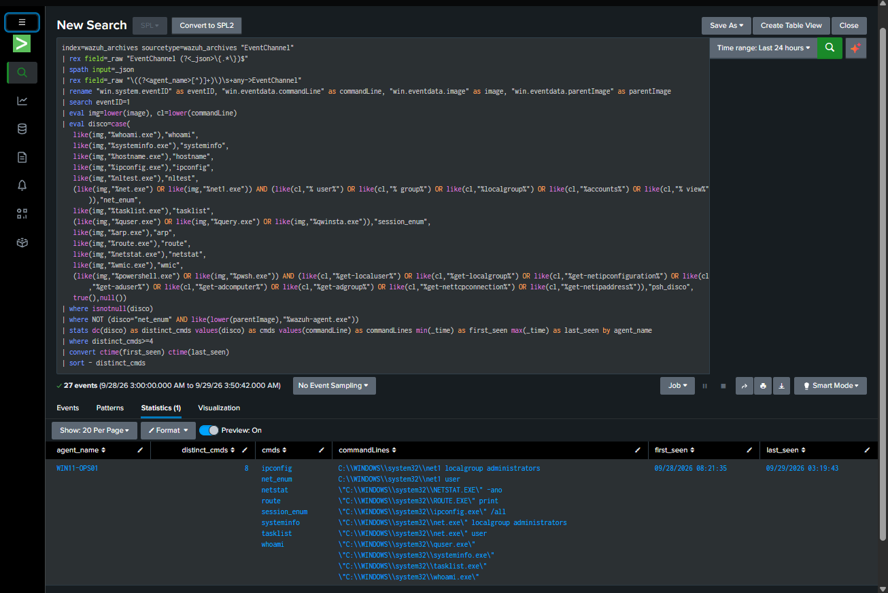
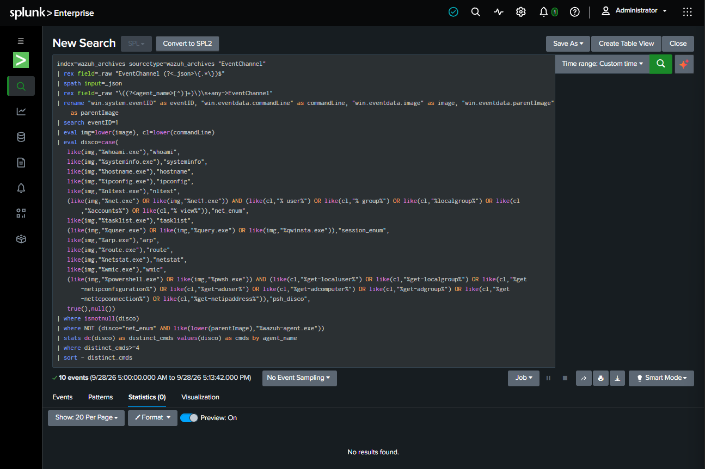

# Results

Two questions, answered with evidence: **what did the SOC catch when attacked**, and
**did the fixes hold up when tested cold?**

## 1. What the operations found

Each phase of each operation was scored by its best outcome.

| Operation | 🟦 Prevented | 🟩 Alerted | 🟨 Logged-only | 🟥 Missed | Headline |
|---|---|---|---|---|---|
| [OP-001](../casebook/op-001-commodity-intrusion.md) Commodity intrusion | 1 | 5 | 1 | 0 | Loud attacker: mostly caught, but the malware launch was buried in a noisy rule |
| [OP-002](../casebook/op-002-stealth-tradecraft.md) Quiet variant | 1 | 5 (1 buried) | 1 | **3** | Same attack done quietly: native discovery, sustained C2 and exfiltration slipped through |
| [OP-003](../casebook/op-003-lateral-movement.md) Lateral movement | 2 | 0 | 0 | **1** | The hop between workstations was invisible, but execution on the target was blocked |

<figure class="cdl-wide" markdown>

<figcaption>OP-002, the control experiment: every phase swapped OP-001's loud technique
for a quiet one. Detection turned out to depend on known tools and IOCs, not on intent.</figcaption>
</figure>

## 2. The fixes (OP-004)

| Gap | Detection built | Validated before enabling |
|---|---|---|
| Native discovery invisible (OP-002) | **D1** · 4+ discovery tools on one host in 10 min | Fired at 8 tools on a replayed burst; busiest normal window on any host = 1 |
| Workstation → workstation hop invisible (OP-003) | **D2** · network/RDP logon between peer workstations | Caught the OP-003 hop; 0 other matches across 7 days of logons |
| Run-key alert misnamed "script host" (OP-002) | **D3** · renamed "Run/RunOnce Key Modified", shows the real writer | Logic unchanged; original kept disabled for rollback |

<figure markdown>

<figcaption>D1 fires: 8 distinct discovery categories on WIN11-OPS01.</figcaption>
</figure>

<figure markdown>

<figcaption>Same search over normal activity: no results.</figcaption>
</figure>

## 3. The blind re-run (2026-09-30)

To check the fixes without bias, techniques were run from an opaque token kit and
investigated **cold**: consoles only, no operation docs, with a benign decoy mixed
in. Then the tokens were revealed and scored.

| Token | Technique (revealed after) | Detected? | Time to detect | Before OP-004 | Now |
|---|---|---|---|---|---|
| a9 | **Decoy**: `Get-Service`, `gpupdate` (normal admin) | Correctly **not** alerted | n/a | n/a | No false positive ✓ |
| p7 | Lateral logon `net use \\10.10.2.4\IPC$` (T1021.002, T1078) | Yes | ~25 s (Wazuh logon) · ~6 min (D2) | 🟥 Missed | 🟩 **Alerted** |
| k2 | Discovery burst (T1082, T1057, T1033, T1016, T1018) | Yes | ~5 min (D1) | 🟥 Missed | 🟩 **Alerted** |
| c1 | Collection off the decoy folder → `loot.zip` (T1005) | No, archive logs only | n/a | 🟨 Logged-only | 🟨 Logged-only (next: D4) |
| x8 | Run key via PowerShell (T1547.001) | Yes | seconds (`510150`) · ~3 min (D3) | 🟩 Alerted | 🟩 Alerted |
| m4 | Run key via `reg.exe` (T1547.001) | Yes | seconds (`92302`) · ~2 min (D3) | 🟩 Alerted | 🟩 Alerted |

4 / 5

techniques found cold, with no help from the attack plan

0

false positives: the decoy was correctly ignored

2

former misses now alerting (discovery, lateral hop)

~2–6 min

time to detect for the scheduled correlations (seconds for real-time Wazuh rules)

The one remaining miss, collection outside the decoy folder, is the next detection
(D4). Time to detect is bounded by the 5–10 minute schedule of the Splunk
correlations; real-time Wazuh rules alerted within seconds.

## What I'd do next

1. **D4: collection and staging** beyond the decoy folder (staging folders, bulk copies, zips in temp).
2. **Beaconing and egress anomaly detection** for sustained C2 and exfiltration to unknown addresses (the [Beacon Hunter](../tools/beacon-hunter.md) tool).
3. **Tune the noise floor**: the rules that buried real alerts under ~1,457 low-value alerts in two hours.
