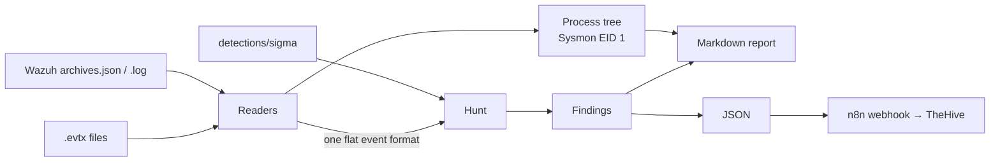

# EVTX Hunter

**Triage Windows event logs from the command line:** run the lab's Sigma rules
over `.evtx` exports or Wazuh archives, rebuild the process tree, and get a report
an analyst can attach to a case, or send the findings straight to n8n.

[:material-github: Source and README](https://github.com/dotslashtag/cyber-defense-lab/tree/main/tools/evtx-hunter){ .md-button .md-button--primary }
[:material-file-document: Full sample report](https://github.com/dotslashtag/cyber-defense-lab/blob/main/tools/evtx-hunter/samples/op002-style-report.md){ .md-button }

## Why I built it

In OP-002, native discovery was **logged but not alerted**. Finding it meant
writing searches by hand over the archive index, and two of those searches
returned false zeros. I wanted a repeatable way to take a host's logs and ask
"what here matches what I know attackers do?", using the same tested rules
that run in the SIEM.

## What it looks like

Run against the synthetic OP-002-style sample (26 events, 2 hosts):

```text
$ evtx-hunter hunt samples/op002-style-archives.json
```

| Time (UTC) | Host | Level | Finding | ATT&CK |
|---|---|---|---|---|
| 09:10:05 | WIN11-OPS01 | medium | Clustered Native Discovery Activity (9 events) | T1033, T1082, T1016, T1057, T1087, T1018 |
| 09:12:00 | WIN11-OPS01 | medium | Run/RunOnce Key Modified By Script Host Or LOLBin | T1547.001 |
| 09:15:00 | WIN11-OPS01 | medium | PowerShell Launched With ExecutionPolicy Bypass | T1059.001 |
| 09:15:10 | WIN11-OPS01 | high | Rundll32 Spawned By PowerShell | T1218.011 |
| 09:16:30 | WIN11-OPS01 | high | Defender Tamper Protection Blocked A Configuration Change | T1562.001 |
| 09:20:00 | Win10 | medium | Workstation-To-Workstation Network Logon | T1021.002, T1078 |

And the process tree it rebuilds around those findings:

```text
(userinit.exe) [WIN11-OPS01.soc.lab]
  └─ 08:00:00 explorer.exe  C:\Windows\Explorer.EXE
     └─ 09:10:00 cmd.exe  "C:\Windows\system32\cmd.exe"
        ├─ 09:10:05 whoami.exe  whoami /all  ◀ Clustered Native Discovery Activity
        ├─ 09:10:09 systeminfo.exe  systeminfo  ◀ Clustered Native Discovery Activity
        │  … 7 more discovery commands …
        ├─ 09:12:00 reg.exe  reg add HKCU\…\Run /v OP002Persist …  ◀ Run/RunOnce Key Modified
        └─ 09:15:00 powershell.exe  powershell.exe -ep bypass -nop -c "iex …"  ◀ ExecutionPolicy Bypass
           └─ 09:15:10 rundll32.exe  rundll32.exe C:\Users\Public\helper.dll,Start  ◀ Rundll32 Spawned By PowerShell
```

The normal activity in the same file (OneDrive writing its own Run key, the Wazuh
agent running `net user` every 5 minutes, local and loopback logons) produces
**no findings**, and the tests check that.

## How it works



**Design decisions:**

- **One event format for two sources.** EVTX records and Wazuh JSON are both
  flattened to Sigma field names (`Image`, `CommandLine`, `TargetObject`…), so the
  rules don't care where the log came from.
- **Undoing a Wazuh quirk.** Wazuh's eventchannel decoder doubles every backslash
  (`C:\\Windows\\…`). Left alone, no path-based rule would ever match. The reader
  fixes it, and a test proves it.
- **Rules only see the right logs.** A rule written for process creation (Sysmon
  Event 1 or Security 4688) is never run against network or registry events that
  happen to have an `Image` field. Without this, rules fire on the wrong events.
- **Correlations use a sliding window.** "4 tools in 10 minutes" is checked from
  every event, not in fixed 10-minute buckets, so a burst that crosses a clock
  boundary still counts. The lab's Splunk version has exactly that weakness (noted
  in OP-004 as a v2 item).
- **Process GUIDs, not PIDs.** The tree links processes by Sysmon's ProcessGuid,
  which is never reused, unlike process IDs.
- **One engine for tests and hunts.** The evaluator that runs the
  [detection tests](../detections/index.md) is the same module that hunts here.
- **Unsupported means error.** If a rule uses a Sigma feature the evaluator
  doesn't understand, it raises an error instead of silently not matching.

## Send findings to TheHive through n8n

The tool posts a JSON summary; n8n turns it into a TheHive alert. Setup in n8n
(no code):

1. **Webhook** node: method `POST`, path `evtx-hunter`. Turn on header auth if
   n8n is reachable from outside the lab.
2. **IF** node: `{{ $json.body.summary.findings }}` is greater than `0`.
3. **TheHive** node (*Alert → Create*):
    - Title: `EVTX Hunter: {{ $json.body.summary.findings }} findings on {{ $json.body.summary.hosts.join(", ") }}`
    - Severity: `{{ $json.body.summary.thehive_severity }}` (1 low … 4 critical)
    - Type `evtx-hunter`, Source `lab`, Source Ref `{{ $json.body.generated }}`
    - Description: the finding titles, e.g. `{{ $json.body.findings.map(f => "- " + f.title + " (" + f.host + ")").join("\n") }}`
4. Run it:

    ```bash
    evtx-hunter hunt Sysmon.evtx Security.evtx --webhook http://<n8n-host>:5678/webhook/evtx-hunter
    ```

!!! tip "Keep the human in the loop"
    This creates an **alert**, not a response. Containment still goes through the
    lab's signed Slack approval workflow.

## Limits

- Supports the Sigma features the lab's rules use: wildcards, `re`, `cidr`,
  numbers, and `value_count`/`event_count` correlations.
- Reading `.evtx` is slow (pure Python, about 200 events per second); for big
  exports, use the Wazuh JSON or filter first.
- Process trees need Sysmon Event ID 1.
- The sample data is synthetic. Tested against a real 2 MB Security log, the
  reader parsed all 2,261 events correctly.
